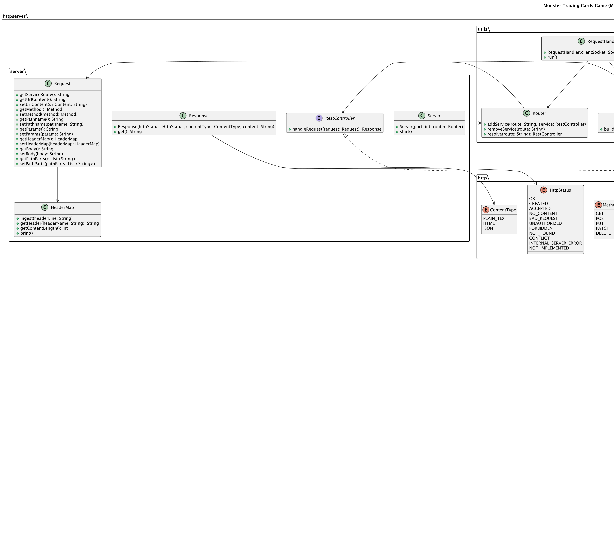

# Documentation MCTG

I will document the progress of my project in this file.

## Table of Contents

- Project-definition
- UML-Diagram
- Design Decisions
- Implementation Progress
- Testing Strategy
- Challenges and Solutions

## Project-definition

The Monster Trading Card Game (MCTG) is a REST-based server application built using Java or C# to enable users to participate in a magical card game. Players can trade, manage, and battle with unique monster and spell cards. The project focuses exclusively on server-side development to support a variety of front-end interfaces (e.g., web, console, or desktop applications).

## UML-Diagram

## Design Decisions

### Overall Structure
The project is structured into logical packages to enforce separation of concerns and modularity. Each package is responsible for a specific layer or functionality, ensuring a clear boundary between HTTP handling, application logic, data persistence, and utility functions.

---

### httpserver Package

#### Purpose
The `httpserver` package handles the HTTP protocol implementation and request-response lifecycle. It abstracts the complexity of HTTP communication, providing a standardized interface for the application layer.

#### Subpackages and Classes
- **http Subpackage**:
    - `ContentType`: Enum defining supported content types (`PLAIN_TEXT`, `HTML`, `JSON`) for flexibility in response formats.
    - `HttpStatus`: Enum listing standard HTTP status codes to maintain consistency in server responses.
    - `Method`: Enum defining HTTP methods (`GET`, `POST`, `PUT`, `PATCH`, `DELETE`) to standardize request processing.

- **server Subpackage**:
    - `HeaderMap`: Manages HTTP headers, enabling easy access to metadata like `Content-Length` and custom headers.
    - `Request`: Represents HTTP requests, encapsulating method, URL, headers, body, and path parts.
    - `Response`: Constructs HTTP responses with status, content type, and body.
    - `Server`: Initializes and starts the HTTP server, tying it to a specific port and router.
    - `Service`: Interface defining a contract for application services to process requests and generate responses.

---

### utils Package

#### Purpose
The `utils` package provides helper classes for routing, request handling, and building structured request objects. It acts as a bridge between raw HTTP communication and the server logic.

#### Classes
- `RequestBuilder`: Parses raw HTTP input streams and converts them into `Request` objects.
- `RequestHandler`: Manages individual client connections, ensuring thread safety and correct request processing.
- `Router`: Manages the mapping between URL paths and corresponding services, enabling dynamic and scalable routing.

---

### application Package

#### Purpose
The `application` package contains the main business logic and entities for the card game. It is divided into controllers, models, and services to follow the MVC pattern, ensuring separation of concerns.

#### Subpackages
- **controller Subpackage**:
    - Acts as a mediator between the services and external interfaces (e.g., API clients).
    - Classes include `Card`, `Deck`, `GameStats`, `Package`, `TradeDeal`, and `User`, which correspond to core entities of the game.

- **model Subpackage**:
    - Defines the core entities of the application:
        - `Card`: Represents cards with attributes like name, damage, and element type.
        - `Deck`: Represents a collection of cards selected for battles.
        - `GameStats`: Tracks user stats, including games played and ELO rating.
        - `Package`: Represents bundles of cards available for purchase.
        - `TradeDeal`: Captures details of card trades and associated conditions.
        - `User`: Represents a player with credentials, coins, and cards.
    - These classes serve as the backbone of the business logic, separating data representation from processing logic.

- **service Subpackage**:
    - Centralizes business logic, with one class per functional area:
        - `CardService`: Handles card management.
        - `GameService`: Implements game and battle mechanics, including ELO calculations.
        - `PackageService`: Manages card package creation and purchases.
        - `TradeService`: Facilitates card trading between players.
        - `UserService`: Manages user authentication, profile updates, and stats tracking.

---

### dal Package

#### Purpose
The `dal` (Data Access Layer) package abstracts persistence, allowing the application to interact with the database or in-memory storage without exposing implementation details.

#### Classes and Interfaces
- `CardRepository`: Manages storage and retrieval of card data.
- `PackageRepository`: Handles operations related to card packages.
- `TradeRepository`: Manages trade deals and their conditions.
- `UserMemoryRepository` (Class and Interface): Facilitates user-related storage in memory, with an interface for potential extension to a database-backed implementation.

---

### Design Rationale
1. **Separation of Concerns**: Each package has a clearly defined responsibility, minimizing dependencies and simplifying maintenance.
2. **Modularity**: By isolating HTTP handling, utilities, business logic, and persistence, the project supports scalability and extensibility.
3. **Reusability**: Models and services are reusable across different controllers, enabling future extension for additional features.
4. **Scalability**: The routing and service mechanisms allow dynamic addition and removal of features without modifying core server logic.
5. **Testability**: The design facilitates unit testing for individual components, such as repositories, services, and utilities.

This structure provides a robust foundation for building the Monster Trading Card Game server, ensuring clean organization and efficient handling of HTTP requests and business logic.

## Implementation Process

## Testing Strategy
